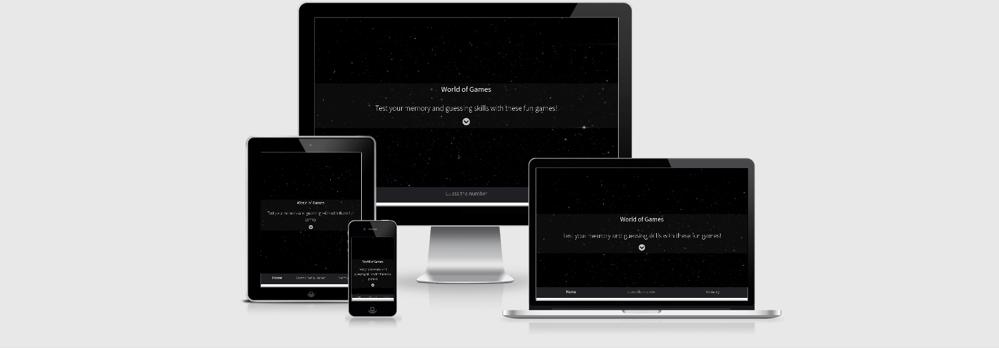
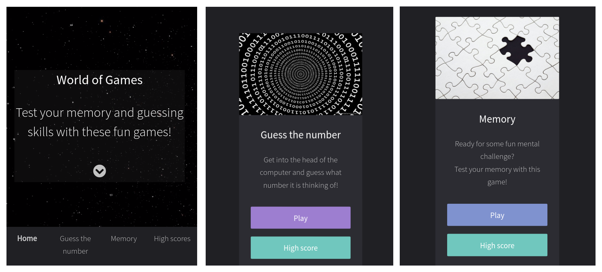
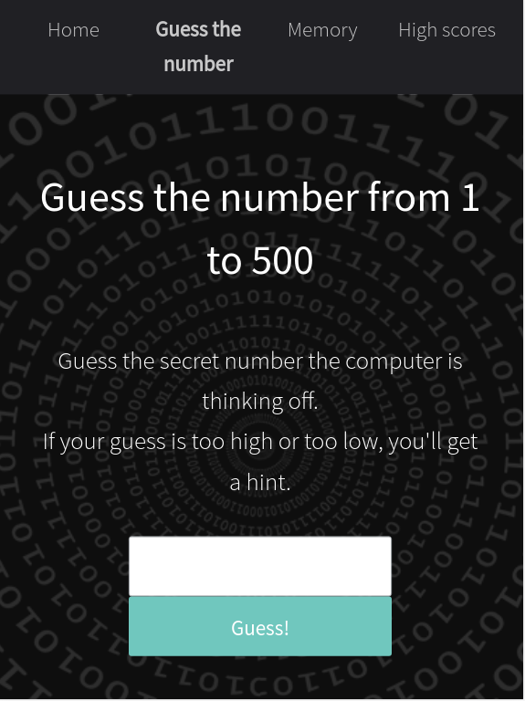
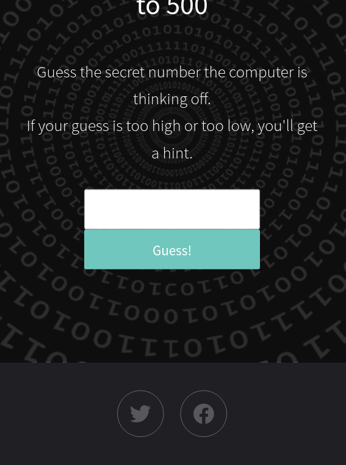
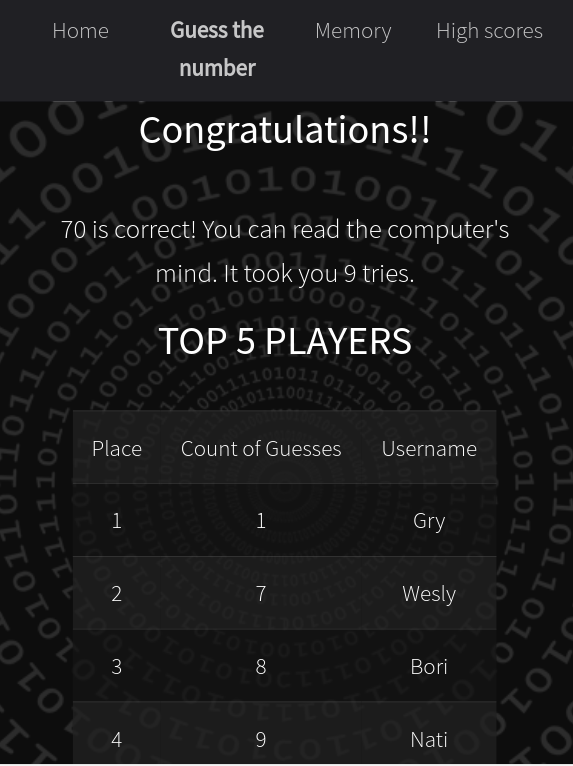
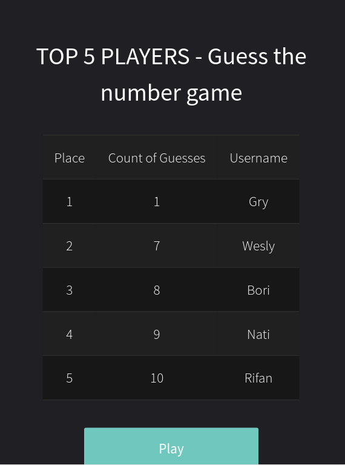

# World of Games
[View the live project here.](https://natalijabujevic0708.github.io/WorldOfGames/)

This is a game website World of Games. A user can choose between Guess the Number and Memory game. It is designed to be responsive and accessible on a range of devices, making it easy to navigate for users who want to play the games.

        
# Design
### Colour Scheme
- The main colours used are black, gray and purple/green for the buttons.
### Typography
 - The "Source Sans Pro" font is the main font used throughout the whole website with Sans Serif as the fallback font in case for any reason the font isn't being imported into the site correctly. 
### Imagery
- Imagery is important. There is a video in the header and it's purpose is to be striking and catch the user's attention.
### Wireframes
- Wireframe - [View](https://drive.google.com/file/d/1z-SbAiCoO5a7hXrxHqOnJYhudbMwTfLN/view?usp=sharing)

# Features

## Navigation bar and Footer
* Each page features a **navigation bar** that includes Home, Guess the number, Memory and High scores.
On a screen size smaller than a tablet the navbar becomes a collapsible element. 

* Each page features **social media links**  at the bottom. They redirect a user to the social media platform opening it in a new window.

## Home page
* Users can learn about the purpose of the site on the Home page.

## Guess the number game
* Users have to guess a number from 1 to 500. They are given hints if the number they guessed is too high or low.

* When a user guesses the correct number, there is a pop-up asking their username. After the user writes it, they are informed of their result (number of guesses) and the high score table appears listing the top 5 scores for that game.

## Memory game
* Users have to flip the cards and match the symbols in pairs.

* When all the pairs are matched, there is a pop-up asking a username. After the user writes it, they are informed of their result (number of tries) and the high score table appears listing the top 5 scores for that game.

## High scores
* There is a High score page with the high scores for both games that can be accessed through the navigation bar or with a link under the description of each game on the Home page.

# User Experience (UX)

-   ## User stories

    -   #### First Time Visitor Goals

        1. As a First Time Visitor, I want to easily understand the main purpose of the site.
        2. As a First Time Visitor, I want to be able to easily navigate throughout the site to find content.
        3. As a First Time Visitor, I want to see links to the social media platforms.

    -   #### Returning Visitor Goals

        1. As a Returning Visitor, I want to find the content and the games the site offers.
        

    -   #### Frequent User Goals
        1. As a Frequent User, I want to see the hige score tables.

# Testing

The W3C Markup Validator and W3C CSS Validator Services were used to validate every page of the project to ensure there were no syntax errors in the project.

-   [W3C Markup Validator](https://validator.w3.org/) - [Result](https://validator.w3.org/nu/?doc=https%3A%2F%2Fnatalijabujevic0708.github.io%2FWorldOfGames%2F)
-   [W3C CSS Validator](https://jigsaw.w3.org/css-validator/) - [Results](https://jigsaw.w3.org/css-validator/validator?uri=https%3A%2F%2Fnatalijabujevic0708.github.io%2FWorldOfGames%2F&profile=css3svg&usermedium=all&warning=1&vextwarning=&lang=en#warnings)
-   [JSHint](https://jshint.com/) - JavaScript code passed through a linter with no major issues.

## Testing User Stories from User Experience (UX) Section

### First Time Visitor Goals

1.  _As a First Time Visitor, I want to easily understand the main purpose of the site._
    
    Upon entering the site, users are automatically greeted with the name of the website and it's purpose.
    Underneath there is a dropdown icon that scrolls to the section with the game descriptions and the buttons to start the games. 
    Underneath the video there is a a navigation bar.

    

2. _As a First Time Visitor, I want to be able to easily navigate throughout the site to find content._
    
    At the top of each page there is a clean navigation bar.

    

3. _As a First Time Visitor, I want to see links to the social media platforms._
    
    There are links to the social media platforms in the footer of every page.
    Whichever link they click, it will be open up in a new tab to ensure the user can easily get back to the website.

     

-   ### Returning Visitor Goals

    1. _As a Returning Visitor, I want to find the content and the games the site offers._
        1. At the home page there are short descriptions of the games.
        2. The navigation bar clearly highlights the pages with different games.

    

        

    
       

-  ### Frequent User Goals

    1. _As a Frequent User, I want to see the hige score tables._
        1. After the user completes a game, there is a pop-up asking their username. After the user writes it, they are informed of their result and the high score table appears listing the top 5 scores for that game.
        
            
        
        
        2. There is a High score page with the high scores for both games that can be accessed through the navigation bar or with a link under the description of each game on the Home page.

            
            

## Further Testing

-   The website was viewed on a variety of devices such as Desktop, Laptop, iPhone, Samsung and Motorola.
-   A large amount of testing was done to ensure that all pages were linking correctly.
-   Friends and family members were asked to review the site and documentation to point out any bugs and/or user experience issues.

## Known Bugs
-   When testing responsiveness on Chrome DevTools some media queries weren't loading properly. There was more testing done on different browsers and the media queries were functioning properly.

# Technologies Used

## Languages Used

-   [HTML5](https://en.wikipedia.org/wiki/HTML5)
-   [CSS3](https://en.wikipedia.org/wiki/Cascading_Style_Sheets)
-   [JavaScript](https://en.wikipedia.org/wiki/JavaScript)

## Frameworks, Libraries & Programs Used

1. [Bootstrap 4.4.1:](https://getbootstrap.com/docs/4.4/getting-started/introduction/)
    - Bootstrap was used to assist with the responsiveness and styling of the website.
1. [Google Fonts:](https://fonts.google.com/)
    - Google fonts were used to import the 'Indie Flower' font into the style.css file which is used on all pages throughout the project.
1. [Font Awesome:](https://fontawesome.com/)
    - Font Awesome was used to add icons for aesthetic and UX purposes.
1. [jQuery:](https://jquery.com/) 
    - jQuery was used to create Guess the Number and  Memory Game.
1. [Git](https://git-scm.com/)
    - Git was used for version control by utilizing the Gitpod terminal to commit to Git and Push to GitHub.
1. [GitHub:](https://github.com/)
    - GitHub is used to store the projects code after being pushed from Git.

# Deployment

## GitHub Pages
- The project was deployed to GitHub Pages using the following steps:

1. Loged in to GitHub and located the [GitHub Repository](https://github.com/natalijabujevic0708/WorldOfGames)
2. At the top of the Repository, located the "Settings" Button on the menu.
3. Scrolled down the Settings page until I located the "GitHub Pages" Section.
4. Under "Source", clicked the dropdown called "None" and select "Master Branch".
5. The page automatically refreshed.
6. Scrolled back down through the page to locate the now published site [World of Games](https://natalijabujevic0708.github.io/WorldOfGames/) in the "GitHub Pages" section.

# Credits

## Code
-   [TEMPLATED](https://templated.co/fullmotion/): CSS, HTML5 & Responsive site template Full Motion by TEMPLATED used throughout the project: index.html basic design, buttons, footer.
-   [Bootstrap4](https://getbootstrap.com/docs/4.4/getting-started/introduction/): Bootstrap Library used throughout the project:  Nav Bar, input field.
-   [Memory game](https://marina-ferreira.github.io/tutorials/js/memory-game/): The code from the tutorial on Marina Ferreiras Github page was used and modified to create the Memory game.
-   CSS rule how to make the scrollbar invisible in style.css line 9 found on Stack Overflow - [link](https://stackoverflow.com/questions/43186015/css-hide-scroll-bar-but-have-element-scrollable/43186311)
-   CSS rule for adjusting the background video in style.css line 17 and 23 found on JSFiddle - [link](https://jsfiddle.net/seadonk/8jmze5yq/2/)
-   Example code for scroll animation in scrollScript.js line 2 found on JSFiddle - [link](http://jsfiddle.net/kevinPHPkevin/8tLdq/1/)
-   Example code for the function makeHighScoreTable in highScore.js line 25 found on Stack Overflow - [link](https://stackoverflow.com/questions/8749236/create-table-with-jquery-append)

## Content

-   Template for the README.md found on https://github.com/Code-Institute-Solutions/SampleREADME

## Media

-   All Images were taken from freely-usable source Pixabay, Vecteezy and Pexels.
    1. backgroundMemory.png - Image by VintageSnipsAndClips from Pixabay.
    2. mandala1.png - Image by Gordon Johnson from Pixabay.
    3. mandala2.png - Image by Gordon Johnson from Pixabay.
    4. mandala3.jpg - Floral Vectors by Vecteezy.
    5. mandala4.png - Image by Gordon Johnson from Pixabay.
    6. mandala5.png - Image by Anne-marie Ridderhof from Pixabay.
    7. mandala6.png - Image by Anne-marie Ridderhof from Pixabay.
    8. puzzle.jpeg - Image by Pixabay.
    9. numbers.png - Image found [here](https://i2.wp.com/www.thementalismcourse.com/wp-content/uploads/2018/03/How-do-mentalists-guess-numbers.png?fit=750%2C500&ssl=1)

-   The video was taken from freely-usable source Pixabay.
     1. Space.mp4 - Video by Vimeo-Free-Videos from Pixabay.

    

## Acknowledgements

-   My Mentor for continuous helpful feedback.
-   Marina Ferreira for her tutorial how to create Memory game with JavaScript.
-   TEMPLATED fot their beautiful Full Motion site template.

